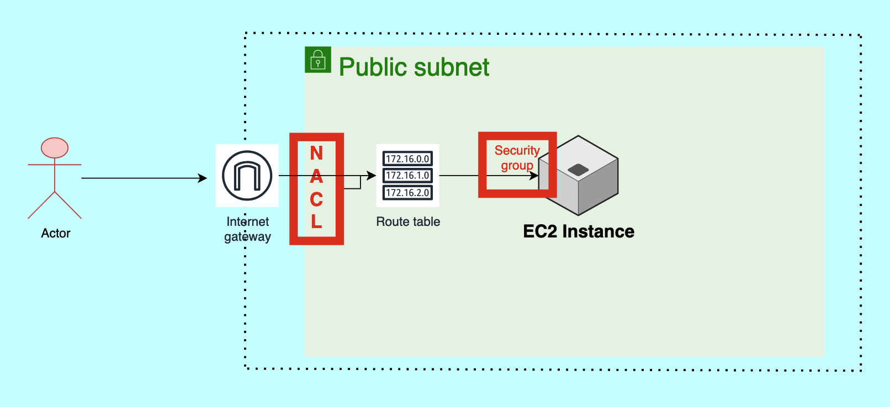

# AWS Mini-Project: Create a Public Subnet and Work with Security Group and NACL 

## Create a VPC

1. **Initiate VPC Creation**:
    - Begin the process to create a VPC.
    - Preview the VPC name, the subnets automatically created by AWS (both private and public).
    - View the default route table (both private and public).
    - Notice network connections, specifically the Internet Gateway (IGW) and S3 bucket.

2. **VPC Configuration**:
    - Assign a name to the VPC.
    - Select `IPv4` and choose the number of IPs if you already have a count in mind.
    - Determine the availability zone (default is set to 2).
    - Select the number of public subnets (choose 2 for this project).
    - Observe the VPC creation process: Creation of the VPC, DNS setup, subnet creation, internet gateway setup, and route table creation.

3. **Post-Creation**:
    - Once the VPC is created, review the associated resource map.

## Create an EC2 Instance

4. **Initiate EC2 Creation**:
    - Navigate to EC2 -> Instances -> Launch Instance.
    - Choose a name, flavor (Ubuntu), and instance type (`t2.micro`).
    - Select your key pair for secure access.

5. **Network Configuration**:
    - Instead of opting for the default VPC, use the VPC created in the previous steps.
    - By default, a private subnet may be chosen; however, for this project, switch to the public subnet.
    - Opt to assign a public IP address to the instance.

6. **Security Group**:
    - Choose to create a new security group.
    - Launch the instance.

7. **Access and Setup**:
    - SSH into the EC2 instance using: `ssh -i aws_login.pem ubuntu@10.0.0.0`.
    - Update system packages with `sudo apt update`.
    - Check if Python3 is installed.
    - Create a temporary server using: `python3 -m http.server 8000`.

## Testing and Adjusting Security Rules

8. **Initial Test**:
    - Attempt to access the server using the public IP on port 8000. Notice it doesn't work due to the default security settings (only SSH allowed).
    - Recognize that by default, NACL allows all inbound traffic, which then goes to the route table.

9. **Adjust Security Group**:
    - Edit the security group's inbound rules to add a custom TCP rule for port 8000, allowing traffic from any source.
    - After adjusting the rule, accessing the server with the public IP on port 8000 should now work.

10. **Adjust NACL**:
    - To deny traffic on port 8000, navigate to the NACL settings and modify the inbound rules. Add a rule to deny custom TCP traffic on port 8000 from any source (`0.0.0.0/0`).
    - Following this, accessing the server on the public IP and port 8000 should be blocked.

11. **Rule Priority in NACL**:
    - Adjust the previously set NACL rule to rule number 200 (it was set to 100 earlier).
    - Add a new rule with rule number 100, allowing all traffic from any source (`0.0.0.0/0`).
    - Even after denying port 8000 in rule number 200, the server remains accessible because NACL rules are executed in ascending order based on rule numbers.
    - To block traffic, simply reverse the rule numbers.

With these steps, you've successfully set up a VPC, launched an EC2 instance within it, and played around with security group and NACL settings to control traffic to the instance.
