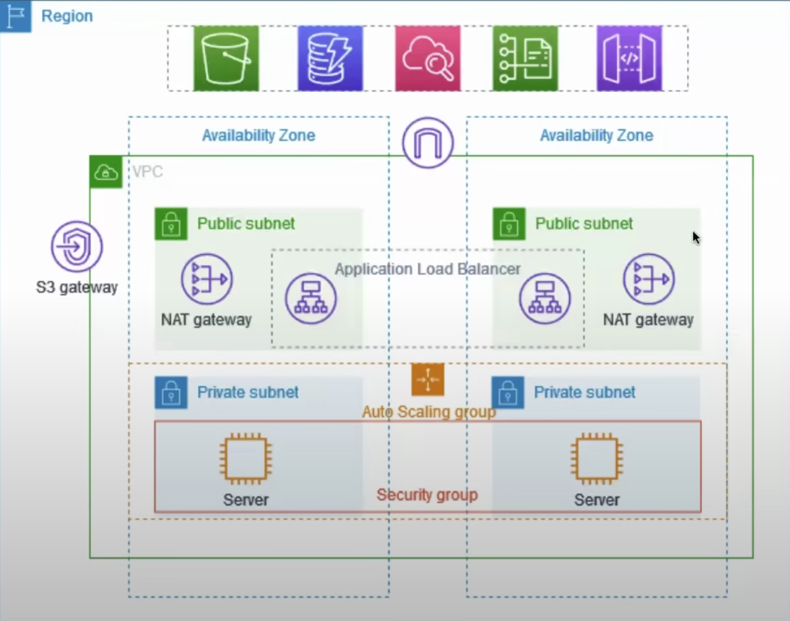

# AWS Project Report: Creating a Production-ready VPC

This project demonstrates the process of creating a Virtual Private Cloud (VPC) suitable for hosting servers in a production environment.

## Objectives:

- Enhance resiliency by deploying the server across two availability zones.
- Utilize an auto-scaling group and an application load balancer.
- For heightened security, position servers within private subnets.
- Servers receive requests via the load balancer and connect to the internet using a NAT gateway.

## Overview:

1. The VPC consists of both public and private subnets spread across two availability zones. Utilizing two zones provides a robust, production-like environment.
2. Each public subnet houses a NAT gateway and a load balancer node. The NAT gateway masks IP addresses.
3. Servers, located in the private subnets, operate based on the auto-scaling group's parameters and obtain traffic from the load balancer.
4. These servers establish internet connections using the NAT gateway.

## Prerequisites:

1. **Auto-scaling**: Initiate with a minimum of two replicas. If insufficient, decide on adding more servers.
2. **Load balancer**: Balances the workload among servers.
3. **Target group**.
4. **Bastion Host/Jump Server**: Used to connect to the private subnet as these servers lack a public IP. It offers extensive logging and rule configuration.

## Steps:

1. **VPC Creation**: Set up the VPC, including subnets, an Internet Gateway (IGW), route table, and NAT gateway (one for each availability zone). Note: The NAT gateway is a paid service.
2. **Auto-scaling Setup**: In EC2, design a launch template. This includes naming, choosing the latest AMI, selecting the free instance type, picking a key-value pair, configuring network settings, and setting up required ports like SSH (22) and the application port (8000).
3. **Using the Launch Template**: Choose the recently crafted template, name the auto-scaling group, input VPC details, select availability zones (private subnets), and set desired group sizes (e.g., desired: 2, min: 1, max: 4).
4. **Instance Verification**: In EC2, confirm if the instances were successfully initiated and identify their regions.
5. **Bastion Host Setup**: Since direct instance login isn't possible without a public IP, utilize a Bastion Host.
6. **Secure Copy (SCP) to Bastion Host**: Transfer the `aws-login` key to the Bastion Host and SSH into it.
7. **SSH into Private Instance**: From the Bastion Host, SSH into the private instance in the private subnet and install the Python application. Create an `index.html` and initiate the server using `python3 -m http.server 8000`.
8. **Load Balancer Configuration**: Establish an application load balancer, ensuring it's positioned within the public subnet and faces the internet. It should belong to the previously created VPC and be attached to the security group. Subsequently, create a target group, pick instances, and set the protocol to HTTP on port 8000.
9. **Testing**: Utilize the load balancer URL to observe its behavior and ensure correct load distribution.

## Note:

If you encounter an "Elastic IP limit exceeded" error, you should release any unnecessary Elastic IP addresses.

